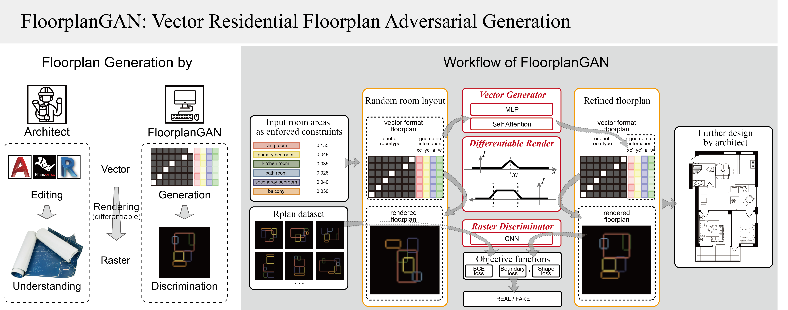

# FloorplanGAN  
 Ziniu Luo, Weixin Huang*  
*School of Architecture, Tsinghua University, Beijing, China*  

 Code and instruction for our Automation in Construction submission:**"FloorplanGAN: Vector Residential Floorplan Adversarial Generation"**.  
### Introduction  
**FloorplanGAN** is a domain specific GAN combines Vector Generator and Raster Discriminator. It aims to synthesis vector residential floorplans based on *Adversiral Generation*, *Differentiable Rendering* and *Self-Attention*, etc.

### Vector Generator

### Installation

1.  dependency  
```
(base)$ conda create -n floorplangan python=3.8 -y
(base)$ conda activate floorplangan
(floorplangan)$ pip install -r requirement.txt
``` 
### Dataset  
we use a publicly available dataset *RPlan* ([http://staff.ustc.edu.cn/~fuxm/projects/DeepLayout/index.html](http://staff.ustc.edu.cn/~fuxm/projects/DeepLayout/index.html)), which contains 80k+ well annotated real residential floorplans in PNG format.  
After the filtering and vectorization (using [Pyportace](https://pypi.org/project/pypotrace/)) described in our paper, we get a training set of 17154 samples and a test set of 2000 samples, all in vector format. The preprocessed data can be download [here](https://cloud.tsinghua.edu.cn/df9310261ee5846998730/).  
Make directory `data_FloorplanGAN` in root directory of this project, and unzip the downloaded zipfile in this folder. 
Directory structures should be like:
```
FloorplanGAN
|---data_FloorplanGAN
|   |---names
|   `---pkls
|---main.py
|---models.py
|---dataset.py
...
```

### Configuration  
modify `config.yaml` to meet your demand:
- NUM_GPUS: number of GPUs used in training.
- NUM_WORKERS: number of CPU cores used in data loading.
- BATCHSIZE: change the batchsize according to the GPU memory. 

Others are supposed to remain unchanged.

### Training from scratch
 
1.  Train with single GPU
```
(floorplangan)$ python main.py
``` 
2. Or multi-GPUs (e.g. 4 GPUs)
```
(floorplangan)$ torchrun --nproc_per_node=4 main.py
```
2.  Visualize the training process  
``` 
(floorplangan)$ tesorboard --logidr=runs_rplan
``` 
### Testing with pretrained model
~~Follow the instruction in [test.ipynb](FloorPlanGAN.ipynb)~~  
Coming soon...
### Evaluating with diverse metrics
Coming soon...
### Contribution
1. luozn15@qq.com (Z. Luo)
2. wxhuang@mail.tsinghua.edu.cn (W. Huang*)
### Acknowledgement
This work is supported by the grant No.51778315 of National Science Foundation of China.We would like to thank licensed architects and master students of architecture for participating in our user study.
